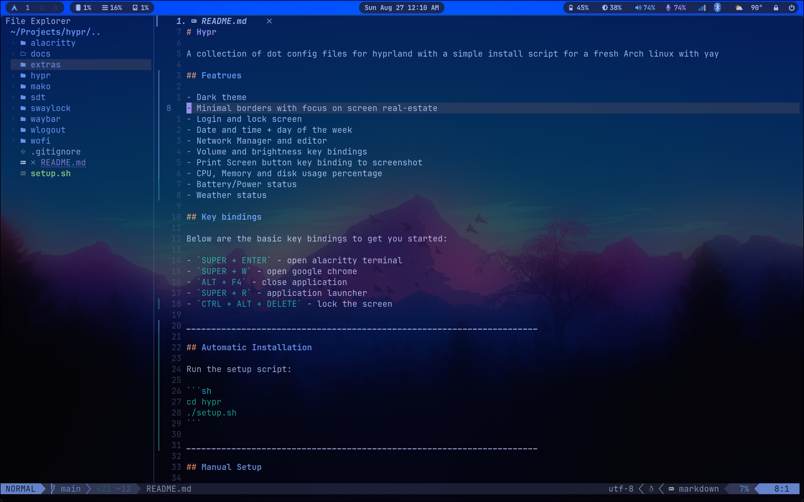

# Hypr

A collection of dot config files for hyprland with a simple install script for a fresh Arch linux with yay

## Featrues

- Dark theme
- Minimal borders with focus on screen real-estate
- Login and lock screen
- Date and time + day of the week
- Network manager/editor
- Bluetooth pairing
- Volume and brightness key bindings
- Print Screen button key binding to screenshot
- Screen recording with MOD+SHIFT+Print key binding
- CPU, temperature, memory and disk usage percentage
- Battery/Power status
- Weather status

## Preview



## Key bindings

Below are the basic key bindings to get you started:

- `SUPER + ENTER` - open alacritty terminal
- `SUPER + W` - open google chrome
- `ALT + F4` - close application
- `SUPER + R` - application launcher
- `CTRL + ALT + DELETE` - lock the screen

______________________________________________________________________

## Automatic Installation

Run the setup script:

```sh
git clone https://github.com/adonespitogo/hypr.git
cd hypr
./setup.sh
```

After the setup, make sure to enable pipewire:

```sh
$ systemctl --user enable --now pipewire-pulse.service
```

______________________________________________________________________

## Manual Setup

You can grab the config files and install packages by hand with this commnad

```
yay -S hyprland-bin alacritty google-chrome waybar-hyprland swww \
swaylock-effects wofi wlogout mako xdg-desktop-portal-hyprland-git \
swappy grim slurp thunar polkit-gnome python-requests pamixer \
pavucontrol brightnessctl bluez bluez-utils blueman \
network-manager-applet gvfs thunar-archive-plugin file-roller btop \
pacman-contrib starship ttf-jetbrains-mono-nerd noto-fonts-emoji
lxappearance xfce4-settings sddm-git sddm-sugar-candy-git \
pipewire wireplumber pipewire-pulse pipewire-audio pipewire-alsa
```

Or you can use the attached script "setup.sh" to install everything for you.

______________________________________________________________________

### List of packages

Below is a list of the packages that would be installed

- hyprland-bin: This is the Hyprland compositor
- alacritty: This is the default terminal
- google-chrome: This is the default browser
- waybar-hyprland: This is a fork of waybar with Hyprland workspace support
- swww: This is used to set a desktop background image
- swaylock-effects: This allows for the locking of the desktop its a fork that adds some editional visual effects
- wofi: This is an application launcher menu
- wlogout: This is a logout menu that allows for shutdown, reboot and sleep
- mako: This is a graphical notification daemon
- xdg-desktop-portal-hyprland-git: xdg-desktop-portal backend for hyprland
- swappy: This is a screenshot editor tool
- grim: This is a screenshot tool it grabs images from a Wayland compositor
- slurp: This helps with screenshots, it selects a region in a Wayland compositor
- thunar: This is a graphical file manager
- polkit-gnome: needed to get superuser access on some graphical application
- python-requests: needed for the weather module script to execute
- pamixer: This helps with audio settings such as volume
- pavucontrol: GUI for managing audio and audio devices
- brightnessctl: used to control monitor and keyboard bright level
- bluez: the bluetooth service
- bluez-utils: command line utilities to interact with bluettoth devices
- blueman: Graphical bluetooth manager
- network-manager-applet: Applet for managing network connection
- gvfs: adds missing functionality to thunar such as automount usb drives
- thunar-archive-plugin: Provides a front ent for thunar to work with compressed files
- file-roller: Backend set of tools for working with compressed files
- btop: Resource monitor that shows usage and stats for processor, memory, disks, network and processes.
- pacman-contrib: adds additional tools for pacman. needed for showing system updates in the waybar
- starship: allows to customize the shell prompt
- ttf-jetbrains-mono-nerd: Some nerd fonts for icons and overall look
- noto-fonts-emoji: fonts needed by the weather script in the top bar
- lxappearance: used to set GTK theme
- xfce4-settings: set of tools for xfce, needed to set GTK theme
- sddm-git: developement version of SDDM which is a display manager for graphical login
- sddm-sugar-candy-git: an sddm theme my theme is based on (copy of)
- pipewire: to enable audio

______________________________________________________________________

## Credits

This setup is based from `SolDoesTech`'s [HyprV2](https://github.com/SolDoesTech/HyprV2) config.
